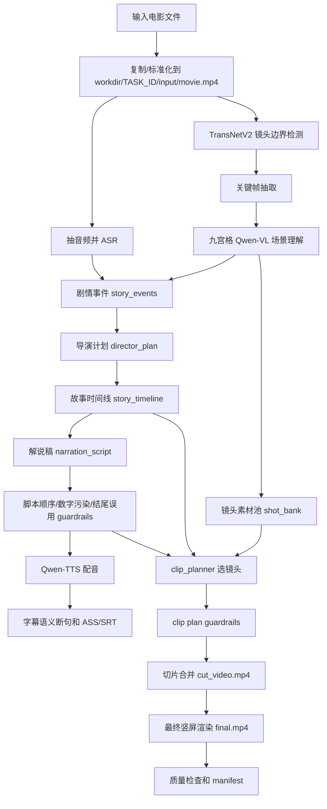

# 项目交接文档：Auto Movie Narrator Qwen

更新时间：2026-07-01

本文档面向后续接手开发的人，目标是说明当前项目如何把一部长电影自动生成中文电影解说视频，以及如何在 Windows 当前环境里一键复现完整流程。

## 1. 项目目标

本项目用于把电影或长视频自动处理成中文电影解说成片，核心不是简单拼接片段，而是尽量模拟人工电影解说的制作链路：

```text
长电影输入
  -> 音频/字幕理解
  -> TransNetV2 镜头边界检测
  -> 九宫格 Qwen-VL 视觉理解
  -> 剧情事件整理
  -> 导演计划
  -> 故事时间线
  -> 解说稿生成
  -> TTS 配音
  -> 按旁白语义和剧情时间线选镜头
  -> 字幕短视频化
  -> 剪辑/混音/竖屏渲染
  -> 自动质检
  -> 生成 final.mp4 和交付元数据
```

当前方向是“像人工制作”，重点在：

- 开头可以有一小段强钩子，但正片必须按电影剧情前后推进。
- 画面必须服务当前旁白，不允许大段错位。
- 字幕时间必须跟随 TTS 音频时间线，而不是只按文本长度估算。
- 镜头边界检测强制使用 TransNetV2。
- 九宫格 Qwen-VL 视频理解流程不能丢弃。
- 自动质检发现低分段落后，应局部重排 clip plan，而不是全片随意重跑。

## 2. 当前主要入口

### CLI 入口

```text
python -m app.cli generate ...
```

对应文件：

- `app/cli.py`：命令行参数、preflight、api-smoke、generate。
- `app/pipeline.py`：完整生成流程的主编排。
- `app/config.py`：环境变量和默认配置。
- `app/storage.py`：任务目录、task.json、voices.json。

### Web/API 入口

```text
uvicorn app.main:app --reload --host 0.0.0.0 --port 8000
```

对应文件：

- `app/main.py`：FastAPI 接口、任务创建、任务查询、声音列表、审核页。

## 3. 必备环境

### Python

当前主要在本机 Conda 环境中运行。建议新人先在项目根目录执行：

```powershell
cd D:\movie_narration\auto_movie_narrator_qwen
python --version
pip install -r requirements.txt
```

### FFmpeg

项目依赖 `ffmpeg` 和 `ffprobe`。当前 Windows 常用路径：

```text
D:\movie_narration\auto_movie_narrator_qwen\workdir\tools\ffmpeg_full
```

如果该目录不存在，可以使用系统 PATH 中已有的 ffmpeg，或重新安装静态 ffmpeg。

### DashScope API Key

真实生成必须设置：

```powershell
$env:DASHSCOPE_API_KEY = "你的 DashScope API Key"
```

不要把 API Key 写入 Git、README、命令历史共享截图或提交记录。

### TransNetV2

当前配置默认：

```text
SCENE_DETECTOR=transnetv2
SCENE_DETECTOR_ALLOW_FALLBACK=false
TRANSNETV2_COMMAND=transnetv2_predict
```

代码位置：

- `app/modules/scene_detect.py`
- `app/config.py`
- `scripts/setup_transnetv2_torch.sh`
- `scripts/run_transnetv2_pytorch.py`

注意：当前 `allow_fallback=False`，TransNetV2 失败会直接失败任务。这是为了避免退回固定时间切段后造成画面、剧情和旁白错配。

## 4. 核心模块职责

### 输入、ASR、场景

- `app/providers/asr.py`：调用 DashScope ASR 或 mock ASR，生成 `asr/transcript.json`。
- `app/modules/scene_detect.py`：调用 TransNetV2 检测镜头边界，再聚合为分析场景。
- `app/modules/keyframes.py`：从视频中抽关键帧。
- `app/modules/vision_analyzer.py`：把关键帧组成九宫格，交给 Qwen-VL 做场景理解。

### 剧情理解和编导

- `app/modules/story_builder.py`：从视觉摘要、字幕和镜头信息中生成剧情事件。
- `app/modules/director_planner.py`：生成导演计划，包括开头钩子、情绪曲线、高潮、结尾留白。
- `app/modules/story_timeline.py`：构建 story timeline，把解说段落绑定到电影时间线事件。
- `app/modules/workflow_guardrails.py`：修复或阻止剧情乱序、结尾误用、clip plan 越界等问题。

### 解说稿、声音、字幕

- `app/modules/script_writer.py`：生成解说稿，开头允许 hook，正片按 story timeline 推进。
- `app/modules/renderer.py`：TTS、字幕文件、剪辑合成、最终渲染。
- `app/modules/subtitle_styler.py`：语义字幕断句、关键词样式、ASS 文本样式。
- `app/providers/qwen_tts.py`：Qwen-TTS 调用。

默认 voice profile：

```text
voice_default_male   -> Ethan
voice_default_female -> Cherry
```

额外测试过 Neil、Vincent 等 profile，但当前交付建议仍使用默认男声或默认女声。

### 镜头池和剪辑

- `app/modules/shot_bank.py`：根据 Qwen-VL 场景摘要整理镜头素材池。
- `app/modules/clip_planner.py`：根据旁白语义、剧情事件和画面标签生成更像人工剪辑的 clip plan。
- `app/modules/renderer.py`：
  - `cut_and_concat`：按 clip plan 切出画面并合并。
  - `compose_final`：配音、原片音频 ducking、字幕、竖屏最终渲染。

### 抖音化和质检

- `app/modules/douyin_viral_templates.py`：爆款恐怖/悬疑解说模板。
- `app/modules/douyin_strategy_planner.py`：标题、角度、钩子策略。
- `app/modules/douyin_packager.py`：生成发布文案、描述、封面相关元数据。
- `app/modules/quality_check.py`：基础质量检查。
- `app/modules/llm_quality_check.py`：LLM 质量审查。
- `app/modules/humanlike_visual_quality.py`：人工感视觉质量检查。
- `app/modules/viral_quality_check.py`：抖音爆款结构质量检查。
- `app/modules/manifest.py`：汇总任务产物为 `manifest.json`。

## 5. 完整生成流程



### 5.1 任务初始化

CLI 创建任务后，会在 `workdir/<TASK_ID>/` 下生成任务目录，并保存：

```text
task.json
input/movie.mp4
```

`task.json` 记录当前状态、进度、原始视频路径、最终视频路径、错误信息等。

### 5.2 ASR 和字幕来源

默认对电影音频做 ASR，生成：

```text
asr/transcript.json
```

如果已有字幕，可以传：

```text
--transcript-json xxx.json
--transcript-srt xxx.srt
```

这样可以跳过或替换 ASR 结果。

### 5.3 TransNetV2 镜头边界检测

当前必须使用 TransNetV2。输出主要包括：

```text
scenes/scenes.json
scenes/scene_detection_meta.json
scenes/transnetv2/raw_shots.json
scenes/transnetv2/run_stdout.txt
scenes/transnetv2/run_stderr.txt
```

这些文件用于判断镜头边界是否可靠。如果 TransNetV2 没有跑通，任务应该失败并修环境，不建议静默 fallback 到固定 30 秒切段。

### 5.4 九宫格 Qwen-VL 场景理解

关键帧会被分配到 TransNetV2 聚合出的场景里，再组成九宫格。Qwen-VL 会输出：

```text
analysis/scene_summaries.json
```

这里是后续剧情、镜头池和剪辑计划的核心视觉依据。接手开发时不要删除九宫格流程，因为它能让 Qwen-VL 一次理解一组连续画面，而不是孤立看单张截图。

### 5.5 剧情事件、导演计划、故事时间线

生成文件：

```text
analysis/story_events.json
analysis/storyline.json
analysis/director_plan.json
analysis/story_timeline.json
review/script_story_guardrails.json
```

关键规则：

- 开头 hook 可以引用强冲突、悬念或高潮画面。
- hook 结束后，正片必须从故事起点按电影时间线推进。
- 每个解说段落要绑定 story event。
- 禁止把结尾或片尾长时间提前当正片素材使用。
- 禁止为了刺激感打乱主体剧情顺序。

### 5.6 解说稿生成

生成文件：

```text
script/narration_script.json
```

后续 TTS 后还会生成：

```text
script/narration_with_audio.json
```

已修过的重要问题：

- 不能让类似 `316.5:`、`527.632:`、`3817.824:` 这种视觉证据时间戳进入解说稿。
- 开头字幕不能出现非解说内容。
- 解说稿不能把片尾、字幕卡、演职员表当成主要剧情。

后续开发时，如果改动 `script_writer.py` 或提示词，必须重新验证这些问题。

### 5.7 TTS、字幕和时间线

TTS 后每段会获得真实音频时长，字幕应基于 TTS 后的 `start/end` 时间生成。输出：

```text
tts/
render/subtitle.srt
render/subtitle.ass
```

注意：

- 不要只按文本长度估算字幕时间。
- 如果修改了解说文本，必须重新 TTS，再重新生成字幕和剪辑。
- 如果对最终视频做 speedfit，烧录进视频里的字幕是同步的；外置 sidecar 字幕可能不适合单独挂载到 speedfit 后的视频。

### 5.8 镜头池和 clip plan

生成文件：

```text
analysis/shot_bank.json
edit/clip_plan.json
edit/clip_planner_report.json
review/clip_plan_guardrails.json
review/render_timeline_guardrails.before_cut.json
review/render_timeline_guardrails.after_cut.json
review/render_timeline_guardrails.final.json
```

`clip_planner.py` 应该优先满足：

- 当前旁白所在 story event 的时间窗口。
- 当前段落的 visual_intent。
- 强钩子只在开头使用。
- 结尾素材只服务结尾，不提前大段使用。
- 避免连续重复同一镜头或长时间黑屏。
- 避免片头、片尾、水印、字幕卡、演职员表。

### 5.9 最终渲染

主要输出：

```text
edit/cut_video.mp4
render/final.mp4
render/final_speedfit_report.json
render/dialogue_ducking_intervals.json
```

默认会生成竖屏 1080x1920 成片，并进行原片音频 ducking、配音合成、字幕烧录。`--final-speedfit` 会在成片时长偏离目标时做小范围速度调整。

### 5.10 质检和交付元数据

主要输出：

```text
review/quality_report.json
review/llm_quality_report.json
review/humanlike_visual_quality.json
review/viral_quality_report.json
manifest.json
publish/
```

交付时优先查看：

- `manifest.json`
- `review/quality_report.json`
- `review/humanlike_visual_quality.json`
- `review/viral_quality_report.json`
- `render/final.mp4`

## 6. 一键生成长电影解说视频命令

下面命令适用于 Windows PowerShell。目标是从一部长电影生成约 15 分钟中文电影解说视频，默认男声，完整最新工作流，真实 API。

把 `$VIDEO` 换成要处理的电影路径即可。

```powershell
$ErrorActionPreference = "Stop"

cd D:\movie_narration\auto_movie_narrator_qwen

$VIDEO = "D:\movie_narration\movies\你的电影文件.mkv"
if (!(Test-Path -LiteralPath $VIDEO)) {
  throw "Video not found: $VIDEO"
}

$TASK_ID = "movie_" + (Get-Date -Format "yyyyMMdd_HHmmss")

$FFMPEG_DIR = "D:\movie_narration\auto_movie_narrator_qwen\workdir\tools\ffmpeg_full"
if (Test-Path -LiteralPath $FFMPEG_DIR) {
  $env:PATH = "$FFMPEG_DIR;$env:PATH"
}

$env:PYTHONUTF8 = "1"
$env:PYTHONIOENCODING = "utf-8"
$env:PYTHONPATH = (Get-Location).Path
$env:APP_WORKDIR = (New-Item -ItemType Directory -Force -Path "workdir").FullName
$env:APP_MOCK_MODE = "false"
$env:QWEN_REQUEST_TIMEOUT_SECONDS = "600"
$env:QWEN_MAX_RETRIES = "4"
$env:SCENE_DETECTOR = "transnetv2"
$env:SCENE_DETECTOR_ALLOW_FALLBACK = "false"

if (-not $env:DASHSCOPE_API_KEY) {
  $env:DASHSCOPE_API_KEY = Read-Host "DashScope API Key"
}

$cliArgs = @(
  "generate", $VIDEO,
  "--real",
  "--quality-first",
  "--target-duration", "900",
  "--voice-profile-id", "voice_default_male",
  "--task-id", $TASK_ID,
  "--ffmpeg-video-encoder", "libx264",
  "--final-speedfit",
  "--tts-concurrency", "1",
  "--llm-quality-mode", "full"
)

python -m app.cli @cliArgs

Write-Host "Task ID: $TASK_ID"
Write-Host "Final video: $env:APP_WORKDIR\$TASK_ID\render\final.mp4"
Write-Host "Manifest: $env:APP_WORKDIR\$TASK_ID\manifest.json"
```

### 改成默认女声

只改这一行：

```powershell
"--voice-profile-id", "voice_default_female",
```

### 改成 10 分钟左右

只改这一行：

```powershell
"--target-duration", "600",
```

### 交给系统自动决定时长

只改这一行：

```powershell
"--target-duration", "auto",
```

## 7. 运行前检查命令

### 检查 CLI 参数

```powershell
cd D:\movie_narration\auto_movie_narrator_qwen
python -m app.cli generate --help
```

### 检查 API 最小连通性

```powershell
cd D:\movie_narration\auto_movie_narrator_qwen
$env:APP_MOCK_MODE = "false"
$env:DASHSCOPE_API_KEY = Read-Host "DashScope API Key"
python -m app.cli api-smoke --real
```

### 检查 ffmpeg

```powershell
ffmpeg -version
ffprobe -version
```

如果找不到命令，先把 ffmpeg 目录加入 PATH。

### 检查 TransNetV2

```powershell
$env:SCENE_DETECTOR = "transnetv2"
$env:SCENE_DETECTOR_ALLOW_FALLBACK = "false"
$env:TRANSNETV2_COMMAND = "transnetv2_predict"
```

然后跑一次短视频或 mock/测试任务确认 `scenes/scene_detection_meta.json` 中为：

```json
{
  "detector": "transnetv2",
  "status": "ok"
}
```

## 8. 任务目录结构

一个成功任务通常如下：

```text
workdir/<TASK_ID>/
  task.json
  manifest.json
  input/
    movie.mp4
  asr/
    transcript.json
  scenes/
    scenes.json
    scene_detection_meta.json
    transnetv2/
      raw_shots.json
      run_stdout.txt
      run_stderr.txt
  keyframes/
  analysis/
    scene_summaries.json
    story_events.json
    storyline.json
    director_plan.json
    story_timeline.json
    shot_bank.json
  script/
    narration_script.json
    narration_with_audio.json
  tts/
    voice_full.wav
    segment_*.wav
  edit/
    clip_plan.json
    clip_planner_report.json
    cut_video.mp4
  render/
    final.mp4
    subtitle.srt
    subtitle.ass
    final_speedfit_report.json
    dialogue_ducking_intervals.json
  review/
    quality_report.json
    llm_quality_report.json
    humanlike_visual_quality.json
    viral_quality_report.json
    script_story_guardrails.json
    clip_plan_guardrails.json
    render_timeline_guardrails.*.json
  publish/
```

## 9. 异常恢复和局部重跑

这些脚本多数不是 argparse 风格，传 `--help` 会被当成 task id。按下面方式调用。

### 只从已有 cut_video 继续最终渲染

适合最终合成失败、字幕/混音/竖屏渲染中断，但 `edit/cut_video.mp4` 已经存在的情况。

```powershell
cd D:\movie_narration\auto_movie_narrator_qwen
$env:PYTHONPATH = (Get-Location).Path
$env:APP_WORKDIR = (Resolve-Path "workdir").Path
python scripts\resume_render_from_cut.py TASK_ID
```

### 使用已有音频重新规划镜头并渲染

适合画面和旁白错位、clip plan 质量差，但解说稿和 TTS 基本可用的情况。

```powershell
cd D:\movie_narration\auto_movie_narrator_qwen
$env:PYTHONPATH = (Get-Location).Path
$env:APP_WORKDIR = (Resolve-Path "workdir").Path
python scripts\replan_render_existing_audio.py TASK_ID
```

### 稳定剧情重渲染

适合开头或结尾错乱、故事时间线需要重新绑定、但已有分析结果还能复用的情况。

```powershell
cd D:\movie_narration\auto_movie_narrator_qwen
$env:PYTHONPATH = (Get-Location).Path
$env:APP_WORKDIR = (Resolve-Path "workdir").Path
python scripts\rerender_stable_story.py `
  --task-id TASK_ID `
  --video "D:\movie_narration\movies\你的电影文件.mkv" `
  --target-duration 900 `
  --voice-profile-id voice_default_male
```

### 只润色解说稿

适合解说稿口播感差，但注意：润色后如果文本变化，应该重新 TTS、字幕和剪辑，不要只替换文本。

```powershell
cd D:\movie_narration\auto_movie_narrator_qwen
$env:PYTHONPATH = (Get-Location).Path
$env:APP_WORKDIR = (Resolve-Path "workdir").Path
python scripts\polish_narration_script.py TASK_ID
```

## 10. 已知风险和必须守住的约束

### 10.1 字幕和配音错位

原因通常是：

- 修改了解说文本，但没有重新 TTS。
- 使用估算时间生成字幕，而不是 TTS 后的真实时间线。
- 对最终视频做了额外变速，但外置字幕没有同步变速。

开发约束：

- `script/narration_with_audio.json` 应作为字幕和剪辑的主要时间线。
- 文本变化后必须重跑 TTS、字幕、clip plan 或至少重跑相关恢复脚本。
- 最终检查 `review/render_timeline_guardrails.final.json`。

### 10.2 画面和解说稿错配

原因通常是：

- clip plan 没有限制在当前 story event 的时间窗口。
- 开头 hook 的高潮画面影响了后续正片时间线。
- TransNetV2 不可用时退回固定切段，导致镜头边界不准。

开发约束：

- 保持 `SCENE_DETECTOR_ALLOW_FALLBACK=false`。
- 保持 `story_timeline.py` 和 `workflow_guardrails.py` 参与生成。
- 不要绕过 `clip_planner.py` 直接用旧 renderer 机械选片，除非显式使用 `--legacy-workflow` 做对比测试。

### 10.3 开头出现无关字幕或数字

历史问题包括：

```text
316.5:
527.632:
3817.824:
```

这些是视觉证据时间戳，不应该进入口播。开发约束：

- 改提示词后必须搜索 `script/narration_script.json` 和 `script/narration_with_audio.json`。
- 可用正则检查：`\b\d{2,5}\.\d{1,3}:`
- 发现后应在脚本生成和清洗层修，而不是手动改最终字幕。

### 10.4 片头、片尾、黑屏误用

原因通常是视觉摘要或 clip plan 没有识别 bad clips。开发约束：

- `shot_bank.py` 需要继续维护 `bad_clips`、片头片尾、黑屏、演职员表识别。
- `workflow_tail_guard_fraction` 和 final segment guard 不要随便放宽。
- 发现 final.mp4 末尾黑屏时，先查 `edit/clip_plan.json` 和 `review/render_timeline_guardrails.final.json`。

### 10.5 API 超时

真实长电影处理会大量调用 Qwen-VL、Qwen 文本模型、Qwen-TTS。建议：

```powershell
$env:QWEN_REQUEST_TIMEOUT_SECONDS = "600"
$env:QWEN_MAX_RETRIES = "4"
```

TTS 并发建议保持：

```text
--tts-concurrency 1
```

这样更稳，尤其在网络或额度不稳定时。

## 11. 推荐验收清单

每次工作流改动后，至少验证：

```powershell
cd D:\movie_narration\auto_movie_narrator_qwen
python -m pytest `
  tests/test_workflow_guardrails.py `
  tests/test_subtitle_styler.py `
  tests/test_clip_planner.py `
  tests/test_humanlike_visual_quality.py `
  tests/test_story_timeline.py `
  tests/test_qwen_tts_client.py `
  tests/test_scene_detect_transnetv2.py
```

人工验收 final.mp4 时重点看：

- 前 5-15 秒是否有吸引人的 hook。
- hook 后是否从故事开端按时间线推进。
- 是否有数字时间戳进入字幕或配音。
- 字幕是否和配音同步。
- 画面是否与当前旁白同一剧情阶段。
- 是否把结尾或片尾素材提前长时间使用。
- 最后一段是否黑屏、冻结或无意义停留。
- `manifest.json` 是否存在并记录关键产物。

## 12. 后续开发建议

优先级从高到低：

1. 强化字幕强制对齐：TTS 后用更细粒度的字级/短句级时间戳或 ASR 回听校准字幕。
2. 强化 clip plan 与 TTS 时长联动：TTS 时长变化后自动重新生成或校正 clip plan，避免尾部黑屏和画面错位。
3. 继续优化 story timeline：hook 只影响开头，正片严格绑定事件顺序。
4. 增强 bad clip 识别：片头、片尾、字幕卡、黑屏、水印、演职员表、长静帧。
5. 把低分片段局部重剪闭环做成正式流水线：质检低分 -> 局部 repair clip plan -> 重渲染 -> 再质检。
6. 做稳定的发布包：描述、标题、封面、平台文案统一从 manifest/publish 读取。
7. 增加 UI 或批处理队列：让非开发人员只输入电影文件、时长、男女声即可运行。

## 13. Git 和数据注意事项

不要提交：

- `workdir/`
- `movies/`
- `.env`
- API Key
- 大视频文件
- 生成的中间音频、关键帧、final.mp4

可以提交：

- `app/`
- `scripts/`
- `tests/`
- `README.md`
- `CODEX_PROJECT_GUIDE.md`
- `PROJECT_HANDOFF.md`

当前远程仓库：

```text
https://github.com/Anweilong111/movie_narration.git
```

交接时建议让接手人先执行：

```powershell
git clone https://github.com/Anweilong111/movie_narration.git
cd movie_narration\auto_movie_narrator_qwen
python -m app.cli generate --help
```

然后配置 ffmpeg、TransNetV2、DashScope API Key，再跑一条短测试视频，最后再跑长电影。
